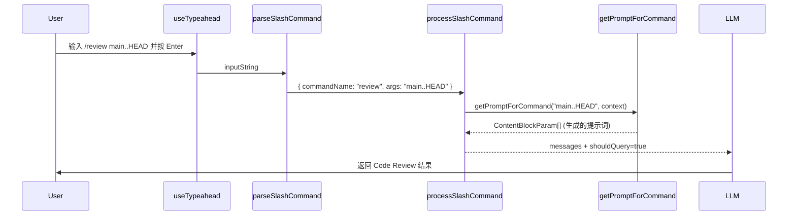

<!-- more -->

## 一、 系统概述

Claude Code 的斜杠命令（Slash Command）系统是一个**终端内的命令面板 + 提示词生成引擎**。用户在输入框键入 `/` 后触发命令匹配、模糊搜索、Tab 补全和 Enter 执行的完整交互链路。该系统由三个核心层次组成：

- **类型层**：定义 `Command` 联合类型，区分三种命令变体
- **UI 层**：基于 Ink 终端渲染框架，实现 Ghost Text 内联补全 + 下拉建议列表
- **执行层**：将命令 + 参数转换为 LLM 提示词（`ContentBlockParam[]`），发送给大模型

## 二、 类型体系

### 1. Command 联合类型

`Command` 是一个**判别联合类型（Discriminated Union）**，定义在 [`src/types/command.ts`](../../claude-code-source/src/types/command.ts#L205-L206) 中：

```typescript
// src/types/command.ts:205-206
export type Command = CommandBase & (PromptCommand | LocalCommand | LocalJSXCommand)
```

联合体的三个变体分别对应不同的执行模式：

### 2. PromptCommand — 提示词型命令

这是最常用的命令类型（Skills），定义在 [`src/types/command.ts`](../../claude-code-source/src/types/command.ts#L25-L57)：

```typescript
// src/types/command.ts:25-57
export type PromptCommand = {
  type: 'prompt'
  progressMessage: string           // 执行时显示的进度文本
  contentLength: number            // 内容长度（用于 token 预估）
  argNames?: string[]              // 参数名列表（用于参数提示 UI）
  allowedTools?: string[]          // 限制可用的工具集
  model?: string                   // 指定使用的模型
  source: SettingSource | 'builtin' | 'mcp' | 'plugin' | 'bundled'  // 命令来源
  pluginInfo?: { ... }             // 插件元信息
  context?: 'inline' | 'fork'      // inline=展开在当前对话, fork=子 Agent 执行
  agent?: string                   // fork 时使用的 Agent 类型
  effort?: EffortValue             // 努力程度
  paths?: string[]                 // 文件路径 glob 过滤
  getPromptForCommand(              // ★ 核心方法：生成 LLM 提示词
    args: string,
    context: ToolUseContext,
  ): Promise<ContentBlockParam[]>
}
```

【**函数作用**】

`getPromptForCommand()` 是整个斜杠命令系统的核心——它接收用户输入的参数字符串和工具上下文，返回一组内容块（`ContentBlockParam[]`），最终作为用户消息发送给 LLM。

【**参数含义**】

- `args`：用户在命令名后键入的参数字符串（如 `/commit fix typo` 中的 `"fix typo"`）
- `context`：包含文件系统、MCP 工具、项目上下文等运行时的 `ToolUseContext`

【**返回值**】

返回 `Promise<ContentBlockParam[]>`——一个或多个 Anthropic API 内容块，通常是文本块（`TextBlockParam`），构成完整的提示词。

### 3. LocalCommand — 本地命令

惰性加载的本地命令，定义在 [`src/types/command.ts`](../../claude-code-source/src/types/command.ts#L74-L78)：

```typescript
// src/types/command.ts:74-78
type LocalCommand = {
  type: 'local'
  supportsNonInteractive: boolean
  load: () => Promise<LocalCommandModule>   // 延迟加载
}
```

用于 `/clear`、`/config` 等不涉及 LLM 调用的纯本地操作。

### 4. LocalJSXCommand — JSX 渲染命令

渲染 Ink JSX UI 的命令，定义在 [`src/types/command.ts`](../../claude-code-source/src/types/command.ts#L144-L152)：

```typescript
// src/types/command.ts:144-152
type LocalJSXCommand = {
  type: 'local-jsx'
  load: () => Promise<LocalJSXCommandModule>
}
```

用于 `/help`、`/init` 等需要渲染复杂 TUI 界面的命令。

### 5. CommandBase — 共享基类字段

所有命令共享的基础字段，定义在 [`src/types/command.ts`](../../claude-code-source/src/types/command.ts#L175-L203)：

| 字段 | 类型 | 说明 |
|---|---|---|
| `name` | `string` | 命令唯一标识符 |
| `aliases` | `string[]?` | 别名列表（如 `w` → `workflows`） |
| `description` | `string` | 命令描述文本 |
| `argumentHint` | `string?` | 参数占位提示 |
| `isHidden` | `boolean?` | 是否从建议列表隐藏 |
| `isEnabled` | `() => boolean?` | 动态启用条件 |
| `availability` | `CommandAvailability[]?` | 可用环境限制 |

## 三、 命令注册与发现

### 1. 中央注册表

所有内置命令在 [`src/commands.ts`](../../claude-code-source/src/commands.ts) 中通过 `COMMANDS()` 函数集中管理（第 258 行起）。这是一个**带记忆化的懒加载数组**，使用 `memoize()` 保证会话内稳定引用：

```typescript
// src/commands.ts:258 (示意)
const COMMANDS = memoize((): Command[] => [
  addDir, advisor, agents, branch, btw, clear, color,
  compact, config, copy, context, cost, diff, doctor,
  effort, exit, fast, files, help, init, mcp, memory,
  model, outputStyle, plugin, review, resume, session,
  skills, status, theme, vim, ...
])
```

### 2. 多源合并策略

除内置命令外，系统从多个来源动态加载命令并合并到主列表中（[`src/commands.ts`](../../claude-code-source/src/commands.ts#L449-L469)）：

| 来源 | 加载函数 | 文件位置 |
|---|---|---|
| 内置 Skills | `getBundledSkills()` | `src/skills/bundledSkills.ts` |
| 用户 Skill 目录 (`~/.claude/skills/`) | `getSkillDirCommands(cwd)` | `src/skills/loadSkillsDir.ts` |
| 插件 Skills | `getPluginSkills()` | `src/utils/plugins/loadPluginCommands.ts` |
| Workflow 脚本 | `getWorkflowCommands(cwd)` | `src/tools/WorkflowTool/createWorkflowCommand.js` |
| MCP 工具命令 | 动态注册 | `src/services/mcp/client.ts` |

## 四、 输入处理与解析

### 1. 斜杠命令检测

当用户输入以 `/` 开头时，[`isCommandInput()`](../../claude-code-source/src/utils/suggestions/commandSuggestions.ts#L200-L202) 判定为命令模式：

```typescript
// src/utils/suggestions/commandSuggestions.ts:200-202
export function isCommandInput(input: string): boolean {
  return input.startsWith('/')
}
```

### 2. 命令解析

[`parseSlashCommand()`](../../claude-code/claude-code-source/src/utils/slashCommandParsing.ts#L25-L60) 将原始输入拆解为结构化数据：

```typescript
// src/utils/slashCommandParsing.ts:25-60
export function parseSlashCommand(input: string): ParsedSlashCommand | null {
  const trimmedInput = input.trim()
  if (!trimmedInput.startsWith('/')) return null

  const withoutSlash = trimmedInput.slice(1)
  const words = withoutSlash.split(' ')
  let commandName = words[0]
  let isMcp = false
  let argsStartIndex = 1

  // 检测 MCP 标记：(MCP)
  if (words.length > 1 && words[1] === '(MCP)') {
    commandName = commandName + ' (MCP)'
    isMcp = true
    argsStartIndex = 2
  }

  const args = words.slice(argsStartIndex).join(' ')
  return { commandName, args, isMcp }
}
```

解析示例：

| 输入 | commandName | args | isMcp |
|---|---|---|---|
| `/w` | `w` | `` | false |
| `/workflows` | `workflows` | `` | false |
| `/search foo bar` | `search` | `foo bar` | false |
| `/code-review main..HEAD` | `code-review` | `main..HEAD` | false |

### 3. 中间输入检测（Mid-input）

系统还支持在非行首位置检测斜杠命令——即用户在一行文字中间键入 `/`。[`findMidInputSlashCommand()`](../../claude-code/claude-code-source/src/utils/suggestions/commandSuggestions.ts#L114-L154) 通过正则 `\s\/([a-zA-Z0-9_:-]*)$` 向前查找空格后紧跟的 `/`：

```typescript
// src/utils/suggestions/commandSuggestions.ts:114-154
export function findMidInputSlashCommand(
  input: string,
  cursorOffset: number,
): MidInputSlashCommand | null {
  // 排除行首情况（已有其他处理逻辑）
  if (input.startsWith('/')) return null

  const beforeCursor = input.slice(0, cursorOffset)
  // 匹配：空白字符 + / + 可选的字母数字冒号下划线连字符
  const match = beforeCursor.match(/\s\/([a-zA-Z0-9_:-]*)$/)
  // ... 返回 { token, startPos, partialCommand }
}
```

## 五、 模糊匹配引擎

### 1. Fuse.js 配置

命令模糊搜索基于 [Fuse.js](https://fusejs.io/) 库，配置在 [`commandSuggestions.ts`](../../claude-code/claude-code-source/src/utils/suggestions/commandSuggestions.ts#L53-L76) 中：

```typescript
// src/utils/suggestions/commandSuggestions.ts:53-76
const fuse = new Fuse(commandData, {
  includeScore: true,
  threshold: 0.3,        // 相对严格的匹配阈值
  location: 0,           // 优先匹配字符串开头
  distance: 100,         // 允许在 description 中远程匹配
  keys: [
    { name: 'commandName', weight: 3 },     // 最高优先级：命令名
    { name: 'partKey', weight: 2 },         // 次高：命令分段（如 code-review 的 code 和 review）
    { name: 'aliasKey', weight: 2 },        // 同等优先级：别名
    { name: 'descriptionKey', weight: 0.5 } // 最低优先级：描述文本
  ],
})
```

关键设计决策：
- **权重分层**：命令名权重为 3，是描述权重的 6 倍，确保精确名称匹配始终优先
- **分段索引**：命令名按 `:`、`_`、`-` 分割后建立子索引，使输入 `code-review` 能同时匹配 `codereview` 和 `code-review`
- **缓存机制**：`fuseCache` 以命令数组的对象引用为 key 缓存 Fuse 实例，避免每次按键重建索引（第 25-28 行）

### 2. 搜索结果排序

Fuse 返回的结果经过二次排序（第 424-473 行），优先级链如下：

```
精确名称匹配 > 精确别名匹配 > 名称前缀匹配 > 别名前缀匹配 > Fuse 模糊分数
                                                                    ↓ 相同分数时
                                                            使用频率更高者优先
```

具体排序代码：

```typescript
// src/utils/suggestions/commandSuggestions.ts:424-473
const sortedResults = withMeta.sort((a, b) => {
  // 1. 精确名称完全一致（最高优先）
  if (aExactName && !bExactName) return -1
  // 2. 精确别名完全一致
  if (aExactAlias && !bExactAlias) return -1
  // 3. 名称前缀匹配
  if (aPrefixName && !bPrefixName) return -1
  // 前缀匹配中，短名称优先（更接近精确）
  if (aPrefixName && bPrefixName && aName.length !== bName.length) {
    return aName.length - bName.length
  }
  // 4. 别名前缀匹配
  if (aPrefixAlias && !bPrefixAlias) return -1
  // 5. Fuse 分数差异 > 0.1 时按分数排
  if (Math.abs(scoreDiff) > 0.1) return scoreDiff
  // 6. 分数相近时，使用频率高的技能优先
  return b.usage - a.usage
})
```

### 3. 使用频率追踪

通过 [`skillUsageTracking`](../../claude-code/claude-code-source/src/utils/suggestions/skillUsageTracking.ts) 记录每个 skill 的调用次数，影响排序结果。仅 `prompt` 类型的命令参与频率统计。

## 六、 UI 渲染机制

### 1. 整体架构

UI 层采用**双层建议系统**并行工作：

```
┌──────────────────────────────────────┐
│  输入框: /wor                        │
│         ━━━━ ghosts (inline)         │  ← Ghost Text（内联补全）
│                                      │
│  /workflows    Browse running...     │  ← Suggestion List（下拉列表）
│  /fewer-perm   Scan your transcr...  │
│  /code-review  Review the current... │
│                                      │
│  [arguments: <path>]                 │  ← Argument Hint（参数提示）
└──────────────────────────────────────┘
```

### 2. Ghost Text — 内联补全

Ghost Text 是显示在光标位置的半透明补全文本，让用户"预见"Tab 键补全后的结果。

#### 数据类型

定义在 [`src/types/textInputTypes.ts`](../../claude-code/claude-code-source/src/types/textInputTypes.ts#L15-L22)：

```typescript
// src/types/textInputTypes.ts:15-22
export type InlineGhostText = {
  /** 显示的 ghost 文本（如 "kflows" 对应 /workflows） */
  readonly text: string
  /** 完整命令名（如 "workflows"） */
  readonly fullCommand: string
  /** Ghost 文本应出现的插入位置 */
  readonly insertPosition: number
}
```

#### 计算时机

Ghost Text 在 [`useTypeahead.tsx`](../../claude-code/claude-code-source/src/hooks/useTypeahead.tsx#L403-L414) 中通过 `useMemo` **同步计算**，避免异步状态导致的一帧闪烁：

```typescript
// src/hooks/useTypeahead.tsx:403-414
const syncPromptGhostText = useMemo((): InlineGhostText | undefined => {
  if (mode !== 'prompt' || suppressSuggestions) return undefined
  const midInputCommand = findMidInputSlashCommand(input, cursorOffset)
  if (!midInputCommand) return undefined
  const match = getBestCommandMatch(midInputCommand.partialCommand, commands)
  if (!match) return undefined
  return {
    text: match.suffix,
    fullCommand: match.fullCommand,
    insertPosition: midInputCommand.startPos + 1 + midInputCommand.partialCommand.length
  }
}, [input, cursorOffset, mode, commands, suppressSuggestions])
```

#### 渲染方式

在 [`Cursor.render()`](../../claude-code/claude-code-source/src/utils/Cursor.ts#L270-L290) 中，Ghost Text 的第一个字符放入反色光标中显示，剩余部分以 `dim`（暗淡）样式追加：

```typescript
// src/utils/Cursor.ts:270-290 (简化)
if (ghostText && ghostText.text.length > 0) {
  const firstGhostChar = firstGrapheme(ghostText.text) || ghostText.text[0]
  const ghostRest = ghostText.text.slice(firstGhostChar.length)
  atCursor = firstGhostChar       // 光标处显示第一个建议字符
  ghostSuffix = ghostText.dim(ghostRest)  // 后续暗淡显示
}
```

视觉效果示例（用户输入 `/wor`，Ghost Text 为 `kflows`）：

```
/wor⟋kflows
    ▔▔ 反色光标覆盖 "k"，"flows" 暗淡
```

### 3. Suggestion List — 下拉建议列表

#### 触发条件

当输入以 `/` 开头且不含实际参数时，[`generateCommandSuggestions()`](../../claude-code/claude-code-source/src/utils/suggestions/commandSuggestions.ts#L292-L298) 生成建议列表：

```typescript
// src/utils/suggestions/commandSuggestions.ts:297-304
if (!isCommandInput(input)) return []
if (hasCommandArgs(input)) return []   // 有参数时不显示建议列表
```

#### 仅输入 "/" 时的展示策略

当用户只输入 `/` 而未键入任何字符时（第 309-380 行），系统采用**分类展示**策略：

1. **最近使用区**：取使用频率最高的 5 个 prompt 命令
2. **内置命令区**：`local` 和 `local-jsx` 类型命令，按字母序排列
3. **用户自定义区**：来源为 `userSettings` 或 `localSettings`
4. **项目级命令区**：来源为 `projectSettings`
5. **策略命令区**：来源为 `policySettings`
6. **其他命令区**：剩余命令

#### SuggestionItem 数据结构

定义在 [`PromptInputFooterSuggestions.tsx`](../../claude-code/claude-code-source/src/components/PromptInput/PromptInputFooterSuggestions.tsx#L9-L16)：

```typescript
// src/components/PromptInput/PromptInputFooterSuggestions.tsx:9-16
export type SuggestionItem = {
  id: string           // 唯一 ID（含来源去重）
  displayText: string  // 显示文本（如 "/workflows"）
  tag?: string         // 标签（如 "workflow"）
  description?: string // 描述文本
  metadata?: unknown   // 关联的 Command 对象
  color?: keyof Theme  // 自定义颜色
}
```

#### 列表渲染组件

[`SuggestionItemRow`](../../claude-code/claude-code-source/src/components/PromptInput/PromptInputFooterSuggestions.tsx#L37) 使用 Ink 的 `<Box>` 和 `<Text>` 组件渲染每一行建议：

```
选中态: ⟨ /workflows ⟩ Browse running and completed workflows...
未选中:  /workflows   Browse running and completed workflows...
```

每行的格式为 `{icon} {displayText} – {description}`，其中：
- 文件类建议图标为 `+`
- MCP 资源图标为 `◇`
- Agent 图标为 `*`

最大显示项数为 `OVERLAY_MAX_ITEMS = 5`（第 18 行），超出部分需滚动查看。

### 4. Argument Hint — 参数提示

当用户完成命令名输入并键入空格后，系统切换到**参数提示模式**（第 730-770 行）。两种提示机制并存：

#### 静态 hint（`argumentHint`）

命令定义中的静态提示文本，仅在首次出现尾部空格时显示：

```typescript
// src/hooks/useTypeahead.tsx:752-753
if (exactMatch?.argumentHint && hasExactlyOneTrailingSpace) {
  commandArgumentHint = exactMatch.argumentHint
}
```

#### 动态 hint（`argNames`）

根据已输入参数数量逐步提示下一个参数（第 756-759 行）：

```typescript
else if (exactMatch?.type === 'prompt' && exactMatch.argNames?.length && value.endsWith(' ')) {
  const argsText = value.slice(spaceIndex + 1)
  const typedArgs = parseArguments(argsText)
  commandArgumentHint = generateProgressiveArgumentHint(exactMatch.argNames, typedArgs)
}
```

例如命令定义了 `argNames: ['file_path', 'issue_number']`，则：
- 输入 `/bug ` → 显示 `[arguments: <file_path>]`
- 输入 `/bug src/main.ts ` → 显示 `[arguments: <issue_number>]`

## 七、 键盘交互

### 1. Tab 键补全

Tab 键的处理逻辑集中在 [`handleTab()`](../../claude-code/claude-code-source/src/hooks/useTypeahead.tsx#L911-L935)，分两个阶段：

#### 阶段一：接受 Ghost Text

如果存在内联 Ghost Text（用户正在输入中间位置或行首的命令补全）：

```typescript
// src/hooks/useTypeahead.tsx:913-934
if (effectiveGhostText) {
  // Bash 模式：直接替换整个输入
  if (mode === 'bash') {
    onInputChange(effectiveGhostText.fullCommand)
    setCursorOffset(effectiveGhostText.fullCommand.length)
    return
  }
  // Prompt 模式中间输入：替换部分命令
  const midInputCommand = findMidInputSlashCommand(input, cursorOffset)
  if (midInputCommand) {
    const before = input.slice(0, midInputCommand.startPos)
    const after = input.slice(midInputCommand.startPos + midInputCommand.token.length)
    const newInput = before + '/' + effectiveGhostText.fullCommand + ' ' + after
    onInputChange(newInput)
    setCursorOffset(newInput.length)
    return
  }
}
```

#### 阶段二：选择建议列表第一项

如果没有 Ghost Text 但有活跃的建议列表，则应用第一个建议（或已选中的建议）：

```typescript
// src/hooks/useTypeahead.tsx:938-950
if (suggestions.length > 0) {
  const index = selectedSuggestion === -1 ? 0 : selectedSuggestion
  if (suggestionType === 'command') {
    applyCommandSuggestion(suggestion, false /* 不执行 */, ...)
    clearSuggestions()
  }
}
```

注意 Tab 键默认**只补全不执行**（第二个参数传 `false`），用户需再按 Enter 执行。

### 2. Enter 键执行

Enter 键在建议激活时有特殊行为（[`PromptInput.tsx`](../../claude-code/claude-code-source/src/components/PromptInput/PromptInput.tsx) 中的 `onSubmit` 处理）：

- 有建议选中时：调用 `applyCommandSuggestion(suggestion, true /* 执行 */)`
- 无建议时：提交当前输入给 `processUserInput`

[`applyCommandSuggestion()`](../../claude-code/claude-code-source/src/utils/suggestions/commandSuggestions.ts#L503-L539) 的完整流程：

```typescript
// src/utils/suggestions/commandSuggestions.ts:503-539
export function applyCommandSuggestion(
  suggestion, shouldExecute, commands,
  onInputChange, setCursorOffset, onSubmit,
): void {
  // 1. 提取命令名和命令对象
  // 2. 格式化为 /commandname  （带尾部空格）
  const newInput = formatCommand(commandName)
  onInputChange(newInput)
  setCursorOffset(newInput.length)

  // 3. 如果要求执行 且 该命令无需参数 → 直接提交
  if (shouldExecute && commandObj) {
    if (commandObj.type !== 'prompt' || (commandObj.argNames ?? []).length === 0) {
      onSubmit(newInput, /* isSubmittingSlashCommand */ true)
    }
  }
}
```

### 3. 上下键导航

在建议列表激活时，↑/↓ 键改变 `selectedSuggestion` 索引，重新渲染高亮行。

## 八、 命令执行流程

### 1. 总体流程

```
用户按 Enter
    ↓
processUserInput() 入口
    ↓
parseSlashCommand(inputString)  ← 解析命令名和参数
    ↓
hasCommand(commandName)?        ← 是否是已知命令？
    ├─ 否 → 当作普通提示词发送给 LLM
    └─ 是 ↓
getMessagesForSlashCommand()
    ↓
判断 command.type:
    ├─ 'prompt'  → getPromptForCommand(args, ctx) 生成 ContentBlockParam[]
    │                ├─ context='inline' → 合并入当前对话消息
    │                └─ context='fork'  → 启动子 Agent 异步执行
    ├─ 'local'   → load().call(args, ctx) 本地执行
    └─ 'local-jsx'→ load().call(onDone, ctx, args) 渲染 JSX UI
    ↓
返回 messages + shouldQuery
    ↓
shouldQuery=true → 发送给 LLM API
shouldQuery=false → 只更新 UI，不调用 LLM
```

### 2. processSlashCommand 主函数

定义在 [`processSlashCommand.tsx`](../../claude-code/claude-code-source/src/utils/processUserInput/processSlashCommand.tsx#L309)：

```typescript
// src/utils/processUserInput/processSlashCommand.tsx:309
export async function processSlashCommand(
  inputString: string,
  precedingInputBlocks: ContentBlockParam[],
  imageContentBlocks: ContentBlockParam[],
  attachmentMessages: AttachmentMessage[],
  context: ProcessUserInputContext,
  setToolJSX: SetToolJSXFn,
  uuid?: string,
  isAlreadyProcessing?: boolean,
  canUseTool?: CanUseToolFn,
): Promise<ProcessUserInputBaseResult>
```

核心步骤：

1. **解析输入**：`parseSlashCommand()` 提取 `commandName`、`args`、`isMcp`
2. **验证命令存在性**：`hasCommand()` 查找注册表
3. **未知命令回退**：若不是已知命令但像命令名，返回错误消息；否则当作普通提示词
4. **委托执行**：`getMessagesForSlashCommand()` 根据 `command.type` 分发处理

### 3. Inline 模式执行（context='inline'）

大多数 Skill 采用此模式——`getPromptForCommand()` 生成的 `ContentBlockParam[]` 作为用户消息的一部分插入对话：



### 4. Fork 模式执行（context='fork'）

部分命令（如 `/commit`、`/schedule`）采用 Fork 模式——启动独立子 Agent 在后台执行：

[`executeForkedSlashCommand()`](../../claude-code/claude-code-source/src/utils/processUserInput/processSlashCommand.tsx#L62-L100) 的关键逻辑：

```typescript
// src/utils/processUserInput/processSlashCommand.tsx:62-100
async function executeForkedSlashCommand(command, args, context, ...) {
  // 1. 准备 fork 上下文（隔离的消息历史、独立的 token 预算）
  const { skillContent, modifiedGetAppState, baseAgent, promptMessages } =
    await prepareForkedCommandContext(command, args, context)

  // 2. Assistant 模式：fire-and-forget，后台并发执行
  if (isAssistantMode) {
    runAgent(...)  // 子 Agent 异步运行
    return { messages: [], shouldQuery: false }  // 立即返回，结果后续注入
  }

  // 3. 交互模式：同步等待子 Agent 完成
  const result = await runAgent(...)
  return { messages: resultMessages, shouldQuery: true }
}
```

Fork 模式的优势：
- **隔离上下文**：子 Agent 有独立的 token 预算，不会消耗主对话的空间
- **并行执行**：Assistant 模式下多个 fork 命令可以并发运行
- **工具权限控制**：可以为子 Agent 设置不同的 `allowedTools`

## 九、 关键文件索引

| 文件 | 职责 |
|---|---|
| [`src/types/command.ts`](../../claude-code-source/src/types/command.ts) | Command 类型定义（联合类型、PromptCommand、LocalCommand、LocalJSXCommand） |
| [`src/commands.ts`](../../claude-code-source/src/commands.ts) | 中央命令注册表、多源命令合并、命令查找函数 |
| [`src/utils/slashCommandParsing.ts`](../../claude-code/claude-code-source/src/utils/slashCommandParsing.ts) | 输入字符串解析（命令名、参数、MCP 标记提取） |
| [`src/utils/suggestions/commandSuggestions.ts`](../../claude-code/claude-code-source/src/utils/suggestions/commandSuggestions.ts) | Fuse.js 模糊搜索、建议列表生成、Tab 补全逻辑、别名匹配 |
| [`src/utils/suggestions/skillUsageTracking.ts`](../../claude-code/claude-code-source/src/utils/suggestions/skillUsageTracking.ts) | Skill 使用频率记录与读取 |
| [`src/components/PromptInput/PromptInputFooterSuggestions.tsx`](../../claude-code/claude-code-source/src/components/PromptInput/PromptInputFooterSuggestions.tsx) | 建议列表渲染组件（SuggestionItemRow） |
| [`src/hooks/useTypeahead.tsx`](../../claude-code/claude-code-source/src/hooks/useTypeahead.tsx) | 核心输入处理 Hook：Ghost Text 计算、Tab/Enter 键处理、建议更新 |
| [`src/types/textInputTypes.ts`](../../claude-code/claude-code-source/src/types/textInputTypes.ts) | InlineGhostText 类型定义 |
| [`src/utils/Cursor.ts`](../../claude-code/claude-code-source/src/utils/Cursor.ts) | 光标渲染器（含 Ghost Text 渲染集成） |
| [`src/utils/processUserInput/processSlashCommand.tsx`](../../claude-code/claude-code-source/src/utils/processUserInput/processSlashCommand.tsx) | 命令执行入口、Inline/Fork 分发、子 Agent 管理 |
| [`src/utils/forkedAgent.ts`](../../claude-code/claude-code-source/src/utils/forkedAgent.ts) | Fork 模式上下文准备、Agent 定义构建 |
| [`src/skills/bundledSkills.ts`](../../claude-code/claude-code-source/src/skills/bundledSkills.ts) | 内置 Skill 加载与包装 |
| [`src/skills/loadSkillsDir.ts`](../../claude-code/claude-code-source/src/skills/loadSkillsDir.ts) | 用户目录 Skill 发现与加载 |

---
*本文档由 markdowncli 技能辅助生成*
